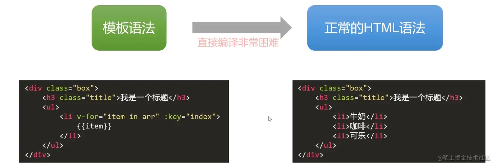
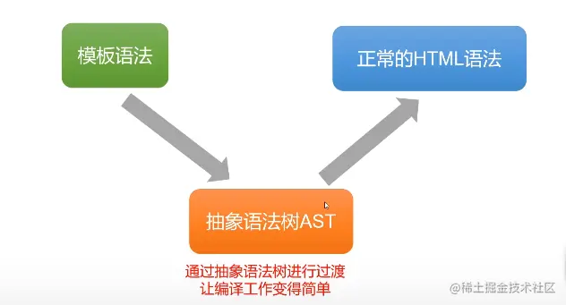
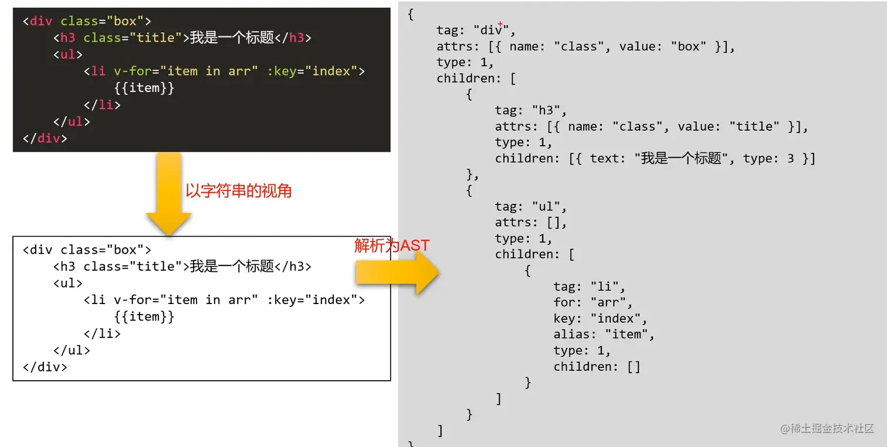
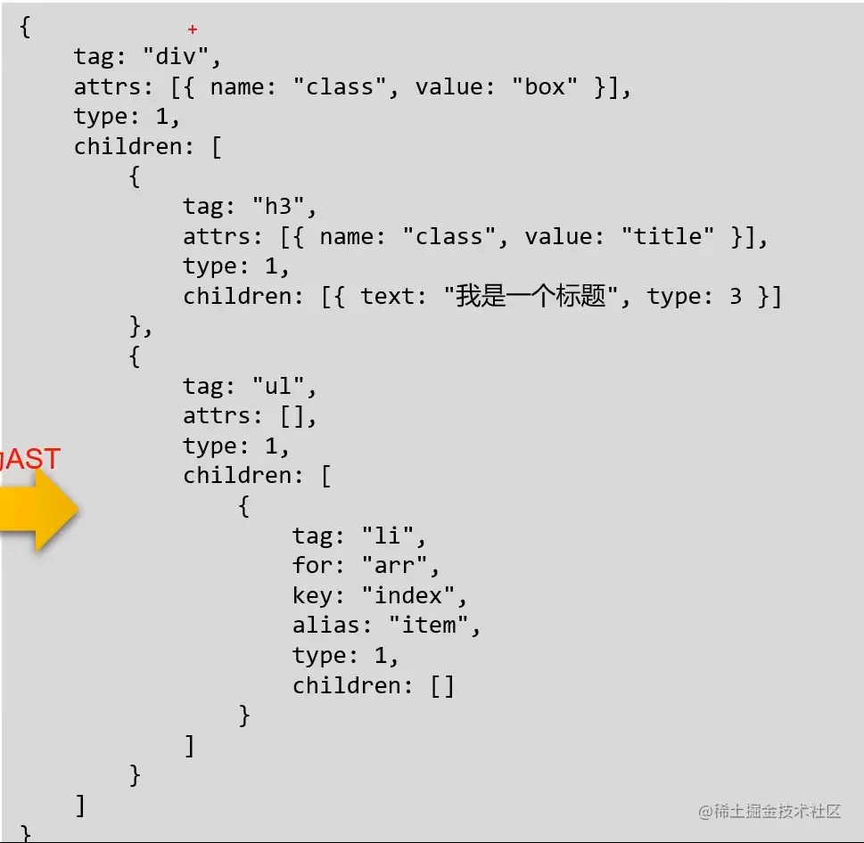
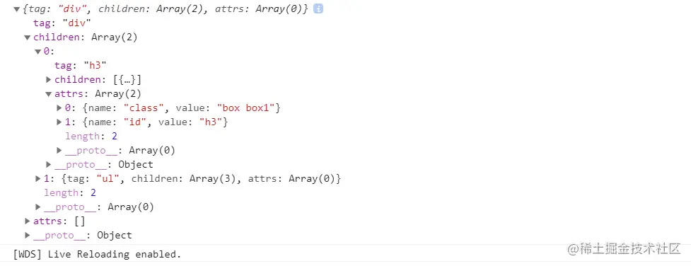

## AST（抽象语法树）的概念

在模板语法中（如v-for循环中）如果我们直接将模板语法编译成正常的HTLM语法是非常困难的。



所以，我们需通过AST抽象语法树，将模板语法转换成正常的HTML语法，如下图所示



那么AST抽象语法树到底是什么呢？其实AST抽象语法树本质上是一个JS对象



上面图中，用JS结构来表示HTML结构实际上就是AST抽象语法树。抽象语法树是服务于模板编译的，从一种语法翻译成另外一种语法，比如 ES6 转 ES5

## 知识储备

在进一步讲述如何将template转化为AST之前，我们先来做一些知识储备，假定你对正则表达式、栈、递归的概念有一些基础的了解，那么请看接下来的这道题。

> 试编写“智能重复”，smartRepeat函数，实现： 将'3\[abc]'变成abcabcabc 将'3\[2\[a]2\[b]]'变成aabbaabbaabb 将'2\[1\[a]3\[b]2\[3\[c]4\[d]]]'变成abbbcccddddcccdddabbbcccddddcccddd

看到题目，一些小伙伴们就可能就会想到用递归的方法进行编写，但是你会发现这个是一个字符串，而且这个`[`不知道是和哪一个 `]` 进行拼接的，所以使用的递归的方法比较麻烦，不是说不可以解题，但是会很复杂。这里我们就需要使用栈的思想来解决问题。

首先需要两个栈stack1和stack2，一个用来存储数字，一个用来存储字符串。

-   [ ] 遍历每一个字符串
-   [ ] 如果这个字符是`数字`，那么就将`数字压入 stack1栈`，把`空字符串压入stack2栈`，
-   [ ] 如果这个字符是`字母`，那么此时就把`stack2栈顶 这一项改为这个字母`，
-   [ ] 如果这个字符是`]`，那么就将`数字从 stack1 栈中弹出`，把 `stack2的栈顶元素重复 stack1中 弹栈的数字的次数`，然后将其`从stack2中弹出，拼接到stack2的新栈顶上`。

分析了思路之后，相关代码如下：


```javascript
function smartRepeat(templateStr) {
    // 指针
    var index = 0
    // 栈1
    var stack1 = []
    // 栈2
    var stack2 = []
    // 尾部
    var rest = templateStr
    while(index < templateStr.length -1) {
        // 改变尾部 剩余部分
        rest = templateStr.substring(index)
        // 检测是否以数字和[开头
        if (/^\d+\[/.test(rest)) {
            // 将数字入栈1
            // 如果这个字符是数字，那么就将数字压入 stack1栈，把`空字符串压入stack2栈，
            let times = Number(rest.match(/^(\d+)\[/)[1])
            stack1.push(times)
            // 将空字符串入栈2
            stack2.push('')
            // 让指针后移 times这个数字多少就后移多少位 +1 
            // +1 是[括号
            index += times.toString().length + 1
        } else if (/^\w+\]/.test(rest)) {
            // 如果这个字符是字母，那么此时就把stack2栈顶这一项改为这个字母，
            let word = rest.match(/^(\w+)\]/)[1]
            // 字母和]开头
            stack2[stack2.length-1] = word
             // 让指针后移 word这个数字多少就后移多少位 
            index += word.length
        } else if(rest[0] == ']'){
            // 如果这个字符是]，那么就将数字从 stack1 栈中弹出，把 stack2的栈顶元素重复 stack1中 弹栈的数字的次数`，
            // 然后将其从stack2中弹出，拼接到stack2的新栈顶上。
            let times = stack1.pop()
            let word =  stack2.pop()
            // repeat是h5中新增的方法 比如： 'a'.repeat(2) = 'aa'
            stack2[stack2.length -1 ] += word.repeat(times)
            index++
        }
        console.log(index, stack1,stack2);
    }
    // while遍历结束 stack1和stack2各剩一项
    return stack2[0].repeat(stack1[0])
}
console.log(smartRepeat('3[2[a]2[b]]')); 

```

&#x20;记住这个解题思路，因为接下来的`词法分析`会用到`栈的思路`去解决问题。

## AST抽象树的手动实现

```javascript
import parse from "./parse";
var templateStr = `<div>
    <h3>你好</h3>
    <ul>
        <li>A</li>
        <li>B</li>
        <li>C</li>
    </ul>
    </div>
`
let ast = parse(templateStr)
console.log(ast);

```

根据以上给出的html代码，我们可以得到转换后的AST抽象语法树应为：



通过观察我们发现，其实这 `AST抽象语法树` 的转换和上面栈的题目几乎差不多，都是要使用两个栈来进行运算，当遇到 `<>标签` 时`进栈`，遇到 `</>标签` `出栈`。所以我们可以借助上面的题目 `栈的思路` 来完成 `AST抽象语法树` 的转换。如果你真的理解上面的题目，这道题你理解起来很非常轻松。

### parse（）方法

```javascript
/**
 * 作用：用来生成AST抽象语法树
 * @param {*} templateStr 传入的模板字符串 
 */
export default function parse(templateStr) {
    // 指针
    var index = 0
    // 栈1 存储标签
    var stack1 = []
    // 栈2 存储文字内容 默认留一项 不用判断stack2结束
    var stack2 = [{'children':[]}]
    // 尾巴
    var rest = templateStr
    // 开始正则
    var startRegExp = /^\<([a-z]+[1-6]?)\>/
    // 结束正则
    var endRegExp = /^\<\/([a-z]+[1-6]?)\>/
    // 文字正则 
    var wordErgExp = /^([^\<]+)\<\/([a-z]+[1-6]?)\>/
    while (index < templateStr.length - 1) {
        rest = templateStr.substring(index)
        // 识别遍历到这个字符的时候，是不是一个开始标签
        if (startRegExp.test(rest)) {
            let tag = rest.match(startRegExp)[1]
            // 入栈
            stack1.push(tag)
            stack2.push({'tag': tag, 'children': []})
            // 指针跳过标签  并且<> 所以要+2
            index += tag.length + 2
        }else if (endRegExp.test(rest)){
            // 识别这个字符是不是结束标签
            let tag = rest.match(endRegExp)[1]
            //此时tag一定和栈1的栈顶相同
            let pop_tag =  stack1.pop()
            if(tag === pop_tag ) {
                // 出栈
                let pop_arr =  stack2.pop()
                // 检测stack2是否有children属性
                if(stack2.length > 0) {
                    stack2[stack2.length - 1].children.push(pop_arr)
                } 
            } else {
                new Error(stack1[stack1.length - 1] + '标签没有闭合')
            }
            
            // 指针跳过标签  并包含</> 所以要+3
            index += tag.length + 3
        } else if(wordErgExp.test(rest)) {
            // 检测到文字
            let word = rest.match(wordErgExp)[1]
            // 文字不能是全空 去除空格
            if(!/^\s+$/.test(word)) {
                // 改变此时stack2栈顶元素
                stack2[stack2.length - 1].children.push({'text': word, 'type': 3})
            }
            index += word.length
        } 
        else {
            index++
        }
    }
    // console.log(stack2);
    return stack2[0].children[0]
}

```

当我们往标签中添加类名的时候，其实会报如下图的错误。

```javascript
import parse from "./parse";
var templateStr = `<div>
    <h3 class="box box1" id="h3">你好</h3>
    <ul>
        <li>A</li>
        <li>B</li>
        <li>C</li>
    </ul>
</div>
`
let ast = parse(templateStr)
console.log(ast);

```


原因很简单，就是在解析标签的时候，会默认将class="box box1" id="h3"也当成标签来处理，所以就会报错，即我们还需要将开始标签的正则进行完善

```javascript
//修改开始正则，如果存在以空格除<之外的任意字符  +表示一个或多个 ？表示没有类名或id 属性名
    var startRegExp = /^\<([a-z]+[1-6]?)(\s[^\<]+)?\>/
 ...
 if (startRegExp.test(rest)) {
            // 获取标签
            let tag = rest.match(startRegExp)[1]
            // 获取属性
            let attrsString = rest.match(startRegExp)[2]
            console.log('开始标记', tag);
            // 入栈
            stack1.push(tag)
            stack2.push({'tag': tag, 'children': [],attrs: attrsString})
            // 指针跳过标签  并且<> 所以要+2
            // 判断是否存在attrsString 因为有些标签是没有attrs属性的
            const attrsStringLength = attrsString != null ? attrsString.length : 0
            index += tag.length + 2 + attrsStringLength
 ...

```


可以发现有了attrs属性，但是attrs属性是一个数组，里面包含name和value的值，所以我们需要对attrs进行改造。

```javascript
attrs:[{name:class,value:box},{name:id,value:h3}]

```

### parseAttrsString（）方法

将attrs改造成数组包含对象name和value属性。


通过上面的动图思路，我们就可以通过这个思路去书写代码：

```javascript
export default function parseAttrsString(attrsString) {
    if (attrsString == undefined) return []
    // 遇到引号 标记 去除不在引号里面的空格 false 不在 true在
    var isClass = false
    // 断点 使用指针的思想
    var point = 0
    // 结果数组
    var result = []
    for (let i = 0; i < attrsString.length; i++) {
        let char = attrsString[i]
        if (char == '"') {
            // 遇到引号 改标记
            isClass = !isClass
        } else if (char == ' ' && !isClass) {
            // 遇到空格并且不在引号内
            if (!/^\s*$/.test(attrsString.substring(point, i).trim())) {
                //去掉空格
                result.push(attrsString.substring(point, i).trim())
                point = i
            }
        }
    }
    // 循环结束之后还剩一项
    result.push(attrsString.substring(point).trim())
    // 映射 将["k = v", "k = v"] 变成[{name: 'k', value:'v'},{name: 'k', value: 'v'}]形式
    result = result.map(item => {
        // 根据等号拆分
        let obj = item.match(/^(.+)="(.+)"$/)
        return {
            name: obj[1],   // 第一个（）的捕获
            value: obj[2]   // 第二个（）捕获
        }
    })
    return result
}

```

最后一个完美的 AST抽象语法树 就完成了，测试结果如下图所示：


