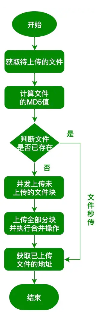

这篇文章按照场景的不同分别讲述了几种文件上传的实现方式以及原理。分别包括：

1.  [ ] 通过form-data格式上传文件
2.  [ ] 通过base64格式上传图片
3.  [ ] 前端选择图片时需要预览，并且需要前端为文件名起一个唯一的标识符的场景
4.  [ ] 前端需要实时展示文件上传进度的场景
5.  [ ] 有多个文件需要批量上传并且均需展示进度条的场景
6.  [ ] 拖拽上传的实现
7.  [ ] 大文件分片上传以及断点重传功能。

## 通过form-data格式上传文件

对于文件上传，我们需要设置请求头为`content-type:multipart/form-data`

因为文件是以二进制的形式存在，其作用是专门用于传输大型二进制数据，效率高

传统前端文件上传的表单结构如下：

```javascript
<form action="http://localhost:8080/api/upload" method="post" enctype="multipart/form-data">
    <input type="file" name="file" id="file" value="" multiple="multiple" />
    <input type="submit" value="提交"/>
</form>
```

`action` 就是我们的提交到的接口，`enctype="multipart/form-data"` 就是指定上传文件格式，`input` 的 `name` 属性一定要等于`file`

注：此处后端使用multiparty实现文件上传处理 和form-data解析

multiparty会自动为文件生成一个hash值编译后的文件名，防止文件名重复出现覆盖的情况

## 通过base64格式上传图片

将图片转化为base64格式的方法有两种

1、image+canvas

```javascript
const getBase64Image = src => {
    return new Promise(resolve => {
        const img = new Image()
        img.crossOrigin = ''
        img.src = src
        img.onload = function () {
            const canvas = document.createElement('canvas')
            canvas.width = img.width
            canvas.height = img.height
            const ctx = canvas.getContext('2d')
            ctx?.drawImage(img, 0, 0, img.width, img.height)
            const ext = img.src.substring(img.src.lastIndexOf('.') + 1).toLowerCase()
            const dataURL = canvas.toDataURL('image/' + ext)
            resolve(dataURL)
        }
    })
}
```

2、xhr+FileReader&#x20;

-   [ ] `readAsDataURL` ， 这个方法会返回一个你得到的这个对象的一个base64的地址，但是这个地址，你会发现你的文件越大，这个地址就越长，其实这个地址是一个`Base64`编码的文件数据字符串

```javascript
const changeBase64 = file => {
        return new Promise(resolve => {
            let fileReader = new FileReader()
            //FileReader里面有个方法readAsDataURL 可以将图片转base64进制
            fileReader.readAsDataURL(file)
            // onload可以监听转换完成后
            fileReader.onload = ev => {
                resolve(ev.target.result)
            }
        })
    }

```

传送的时候需要使用encodeURIComponent方法防止base64中的一些特殊字符被识别为其他内容，并且设置请求头

```javascript
data = await instance.post('/upload_single_base64', {
                file: encodeURIComponent(Base64),
                filename: _file.name
            }, {
                headers: {
                    'Content-Type': 'application/x-www-form-urlencoded'
                }
            })
```

## 预览图片，处理文件名

缩略图的实现使用给img的src绑定base64来处理。

```javascript
base64 = await changeBase64(_file)
        upload_abbre.style.display = 'block'
        upload_abbre_img.src = base64
```

文件名的处理需要用到`readAsArrayBuffer` 和sparkMD5，下面对这两个方法分别做介绍。

`readAsArrayBuffer` 读取指定的Blob中的内容, 一旦完成，result 属性中保存的将是被读取文件的 [ArrayBuffer](https://link.segmentfault.com/?enc=YZvy9U+EOcK4Z2nC//xKdQ==.hHSp8ufxKQYMoRxVPOSy6Z6TMlz/GRlAw6iVG6wl+U9PJqxOEFUwezUN+ldMAnOoORogpIBJBbQAv0hv9kVMYQ== "ArrayBuffer")数据对象。

> **`ArrayBuffer`** 对象用来表示通用的原始二进制数据缓冲区

SparkMD5是一种JavaScript库，用于计算文件的MD5哈希值。它可以用于在浏览器中计算文件的哈希值，而不需要将整个文件上传到服务器。SparkMD5通过分块处理文件，每个块使用JavaScript的ArrayBuffer对象来读取，以便可以快速计算文件的哈希值。

```javascript
const changeBuffer = file => {
        return new Promise(resolve => {
            let fileReader = new FileReader()
            fileReader.readAsArrayBuffer(file)
            fileReader.onload = ev => {
                let buffer = ev.target.result,
                    spark = new SparkMD5.ArrayBuffer(),
                    Hash;
                spark.append(buffer)
                Hash = spark.end()
                suffix = /\.([a-zA-Z0-9]+)$/.exec(_file.name)[1]
                console.log(buffer)
                console.log(spark)
                console.log(Hash)
                resolve({ buffer, Hash, suffix, filename: `${Hash}.${suffix}` })
            }
        })
    }

```

我们创建了一个SparkMD5.ArrayBuffer实例和一个FileReader实例。当用户选择一个文件后，我们使用FileReader读取文件并将数据附加到SparkMD5实例中。最后，我们调用SparkMD5的end()方法来计算文件的哈希值，随后获取文件原本的后缀值拼接到我们生成的哈希值后，作为文件的新文件名。

## 上传进度条

使用axios提供的onUploadProgress来实时获取文件上传进度，这个API的实现实际是基于XMLHttpRequest的upload事件封装的，upload事件本身就提供loaded和total属性。

```javascript
   data = await instance.post('/upload_single', formData, {
                onUploadProgress(ev) {
                    let { loaded, total } = ev
                    upload_progress.style.display = 'block'
                    upload_progress_value.style.width = `${loaded / total * 100}%`
                }
            })
```

在这个例子中，我们POST了一个请求到/upload\_single，并传递了一个对象。该对象包含一个onUploadProgress.属性，该属性是一个回调函数。每当上传进度发生变化时，该函数会被调用。我们可以在该函数中将上传进度百分比输出到控制台。

## 多文件上传

html结构

```javascript
  <div class="item">
            <h3>多文件上传</h3>
            <section class="upload_box" id="upload5">
                <input type="file" class="upload_inp" multiple>
                <div class="upload_button_box">
                    <button class="upload_button select">选择文件</button>
                    <button class="upload_button upload">上传到服务器</button>
                </div>
                <ul class="upload_list">
                </ul>
            </section>
        </div>
```

除了通过循环发送每个文件的请求之外，这里还有一些需要处理的小问题。

首先就是当我们选择完文件后，想要删除其中任意一个，如何为每一个文件绑定一个唯一的id值以确保我们能获取到正确的待删除文件。这里使用random生成随机数再乘以当前的时间来确保每一个文件的id都不同。

```javascript
    const createRandom = () => {
        let ran = Math.random() * new Date()
        return ran.toString(16).replace('.', '')
    }
```

```javascript
 _files = Array.from(upload_inp.files)
        let str = ``
        _files = _files.map(file => {
            return {
                file,
                filename: file.name,
                key: createRandom()
            }
        })
        _files.forEach((item, index) => {
            str += `<li key=${item.key}>
            <span>文件${index + 1}：${item.filename}</span>
            <span><em>移除</em></span>
            </li>`
        })
```

循环发送请求

```javascript
 let upload_list_arr = Array.from(upload_list.querySelectorAll('li'))
        _files = _files.map(item => {
            let fm = new FormData
            //获取当前循环的li
            let curLi = upload_list_arr.find(liBox => liBox.getAttribute('key') === item.key),
            //获取最后一个span，复写删除变成百分比
                curSpan = curLi ? curLi.querySelector('span:nth-last-child(1)') : null;
            fm.append('file', item.file)
            fm.append('filename', item.filename)
            return instance.post('upload_single', fm, {
                onUploadProgress(ev) {
                    //检测每一个上传进度
                    curSpan.innerHTML = `${(ev.loaded / ev.total * 100).toFixed(2)}%`
                }
            }).then(data => {
                if (+data.code === 0) {
                    if (curSpan) {
                        curSpan.innerHTML = `100%`
                    }
                    return
                }
                return Promise.reject()
            })
        })
        Promise.all(_files).then(() => {
            alert('恭喜您，所有文件都上传成功')
        }).catch(() => {
            alert('上传过程中出现问题，请稍后再试')
        }).finally(() => {
            handleDisable(false)
            _files = []
            upload_list.innerHTML = ''
            upload_list.style.display = 'none'
        })
```

## 拖拽上传

主要实现方式为监听drop事件，注意当鼠标拖入目标区域时，dragover事件会被一直触发，这里需要手动阻止默认事件的发生。

另外，上传的过程中，目标区域需要设置一个遮罩层提示用户上传文件正在进行中。

```javascript
 upload.addEventListener('drop', function (ev) {
        ev.preventDefault()
        let file = ev.dataTransfer.files[0]
        if (!file) return
        uploadFile(file)
    })
 const uploadFile = async file => {
        if (isRun) return
        isRun = true
        //显示遮罩层
        upload_mark.style.display = 'block'
        try {
            let fm = new FormData(),
                data;
            fm.append('file', file)
            fm.append('filename', file.name)
            data = await instance.post('/upload_single', fm);
            if (+data.code === 0) {
                alert('上传成功')
                return
            }
            throw data.codeText
        } catch (err) {
            alert('文件上传失败')
        } finally {
            upload_mark.style.display = 'none'
            isRun = false
        }
    }
```

## 大文件分片上传与断点重传

在同一个请求中，要上传大量的数据，导致整个过程会比较漫长，且失败后需要重头开始上传。

大文件上传我们需要考虑三个方面：

-   [ ] **切片：拆分上传请求**
-   [ ] **断点续传**
-   [ ] **显示上传进度和暂停上传**



### 切片

**识别切片来源****保证切片拼接顺序**

-   [ ] 我们一般采用编码的方式进行上传，获取文件对应的二进制内容。
-   [ ] 计算出内容的总大小，根据文件大小切成对应的分片。
-   [ ] 上传时标识出当前文件，告诉后端上传到了第几个(可以用时间戳形式)。
    -   [ ] 不加表示的话，后端在追加切片时，无法识别切片顺序
    -   [ ] 接口异常的情况下无法正确拼接

**实现**
根据文件名、文件长度等基本信息进行拼接
根据文件的二进制内容计算文件的hash，这样只要文件内容不一样，则标识也会不一样，缺点在于计算量比较大.
将文件拆分成piece大小的分块，然后每次请求只需要上传这一个部分的分块即可

### 断点续传

我们在上传或者下载文件的时候，如果已经进行了一部分，这时候网络故障、页面关闭的情况下，不需要从头开始操作，而是从指定位置继续进行操作，这种处理方式就是所说的“断点续传”

**断点：** 的由来是在下载过程中，将一个下载文件分成了多个部分，同时进行多个部分一起的下载，当某个时间点，任务被暂停了，此时下载暂停的位置就是断点了。**续传**：一个任务从暂停到开始时，会从上一次任务暂停处开始(可以每次传输成功后加一个表示为告诉前端传输进度)。

实现思路：

-   [ ] 保存已上传的切片信息
-   [ ] 选择未上传的切片进行上传
-   [ ] 全部上传成功后后端进行文件合并

实现方案：

1.  [ ] 本地存储：我们可以利用localstorage，cookie等方式存储在浏览器内，这种情况下我们不依赖于后端，直接本地读取就行。清理了本地文件，会导致上传记录丢失。
2.  [ ] 服务器知道我们已经传输到了哪些切片，我们通过接口去传输未上传的切片即可

这里采用第二种方法实现

### 上传进度

与前面提到的方法相同

```javascript
 const changeBuffer = file => {
        return new Promise(resolve => {
            let fileReader = new FileReader()
            fileReader.readAsArrayBuffer(file)
            fileReader.onload = ev => {
                let buffer = ev.target.result,
                    spark = new SparkMD5.ArrayBuffer(),
                    HASH;
                spark.append(buffer)
                HASH = spark.end()
                suffix = /\.([a-zA-Z0-9]+)$/.exec(_file.name)[1]
                console.log(buffer)
                console.log(spark)
                console.log(HASH)
                resolve({ buffer, HASH, suffix, filename: `${HASH}.${suffix}` })
            }
        })
    }
```

```javascript
   upload_inp.addEventListener('change', async function () {
        _file = upload_inp.files[0]
        if (!_file) return;
        handleDisable(true)
        upload_button_select.classList.add('loading')
        upload_progress.style.display = 'block'
        let already = [], data = null,
            {
                HASH, suffix
            } = await changeBuffer(_file)
        //获取已经上传的切片信息
        try {
            data = await instance.get('/upload_already', {
                params: {
                    HASH
                }
            });
            if (+data.code === 0) {
                already = data.fileList
            }
        } catch (err) {

        }
        //实现文件切片处理【固定数量&&固定大小】
        let maxSize = 1024 * 100,
            index = 0,
            chunks = [],
            count = _file.size / maxSize;
        if (count > 100) {
            max = _file.size / 100;
            count = 100
        }
        while (index < count) {
            chunks.push({
                file: _file.slice(index * max, (index + 1) * max),
                filename: `${HASH}_${index + 1}.${suffix}`
            })
            index++
        }
        index = 0;
        //上传成功的处理
        const clear = () => {
            upload_button_select.classList.remove('loading')
            upload_progress.style.display = 'none'
            upload_progress_value.style.width = '0%'
        }
        const complete = async () => {
            //管控进度条
            index++;
            upload_progress_value.style.width = `${index / count * 100}%`
            if (index < count) return;
            upload_progress_value.style.width = `100%`
            //当所有切片都上传成功，合并切片
            try {
                data = await instance.post('/upload_merge', {
                    HASH, count
                }, {
                    headers: {
                        'Content-Type': 'application/x-www-form-urlencoded'
                    }
                });
                if (+data.code === 0) {
                    alert('文件上传成功')
                    clear()
                    return;
                }
                throw data.codeText
            } catch (err) {
                alert('切片合并失败')
                clear();
            } finally {
                handleDisable(false)
            }
        }
        //上传切片
        chunks.forEach(chunk => {
            //已经上传的无需再上传
            if (already.length > 0 && already.includes(chunk.filename)) {
                complete()
                return;
            }
            let fm = new FormData;
            fm.append('file', chunk.file)
            fm.append('filename', chunk.filename)
            instance.post('/upload_chunk', fm).then(data => {
                if (+data.code === 0) {
                    complete()
                    return
                }
                return Promise.reject(data.codeText)
            }

            ).catch(() => {
                alert('有切片上传失败')
                clear()
            })
        })
        //使用file原型链上的slice方法
        console.log(_file)
    })
```
